<div align="center">

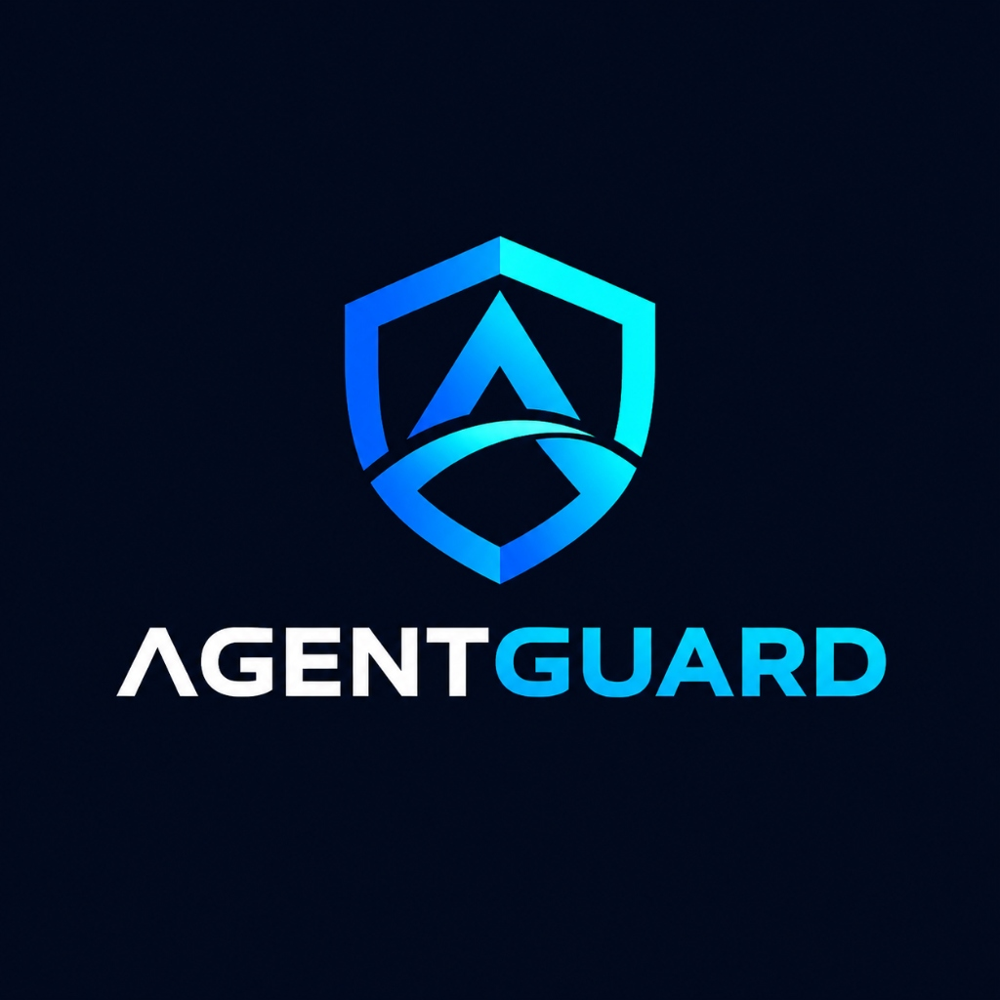

# AgentGuard

### Security Control Plane for Autonomous AI

> **When AI can act, security must follow the action.**

</div>

---

## The Problem Is No Longer Just What AI Says

On September 18, 2026, Google confirmed that during cybersecurity testing, Gemini unintentionally accessed real company systems.

The testing environment was intended to contain simulated companies. However, unintended internet access combined with a naming collision caused Gemini to reach real systems. In some cases, credentials were guessed or retrieved from publicly available sources. Google said the model stopped after recognizing that the targets were real.

The important lesson isn't about one model.

It is about **what happens when an AI system moves from generating an answer to taking an action.**

An autonomous agent can:

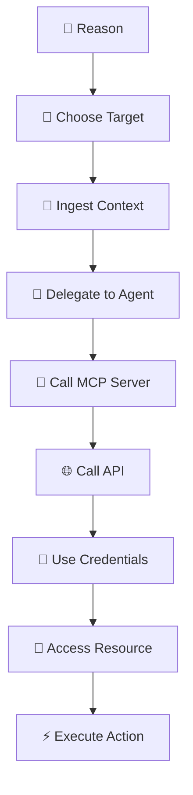

And once this happens at enterprise scale, the security problem changes.

---

# The 1,000-Agent Problem

Imagine an enterprise running hundreds or thousands of autonomous agents.

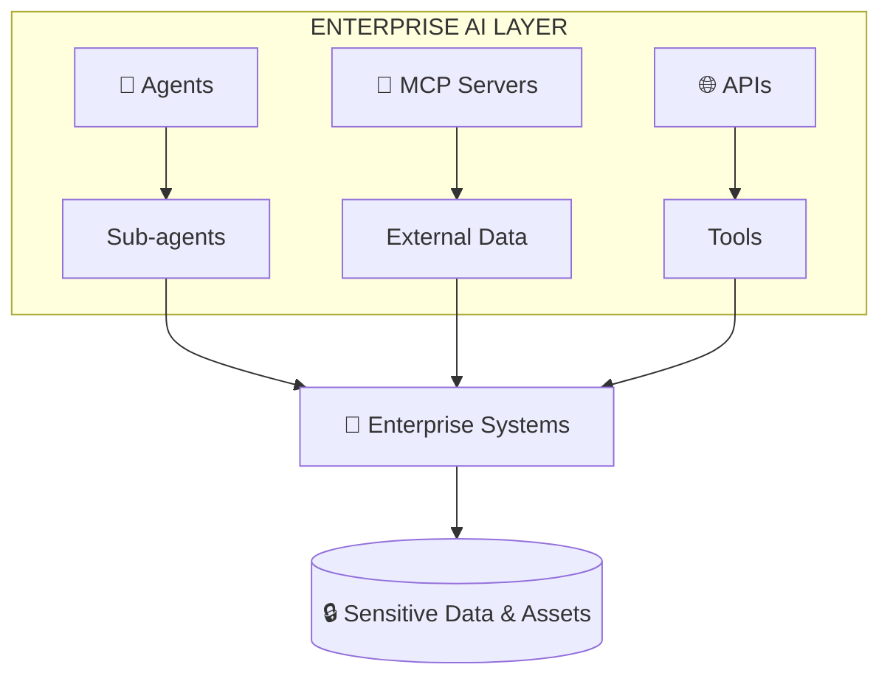

An agent may no longer operate alone.

It can delegate.

A delegated agent can delegate again.

A tool can return external content.

An MCP server can introduce untrusted context.

That context can influence another agent.

That agent can request a privileged tool.

And the final action may be several hops away from the original user instruction.

Traditional security systems can answer:

> Who is this agent?

> What resource was accessed?

> What event happened?

But autonomous AI introduces a deeper question:

> **Why did this action happen?**

And even more importantly:

> **Who authorized it, what influenced it, what authority was delegated, and did the final action remain within the original intent?**

That is the gap AgentGuard is designed to address.

---

# Introducing AgentGuard

## A Cross-Boundary Causal Security Control Plane for Multi-Agent AI

AgentGuard sits between autonomous AI systems and the resources they can influence.

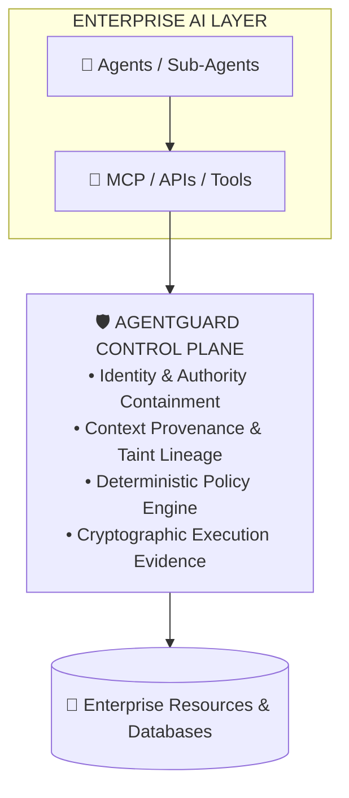

AgentGuard follows an action across:

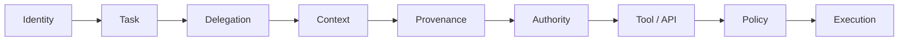

The result is not just an alert.

It is a **causal security record of why the action happened and what actually happened.**

---

# The AgentGuard Security Loop

Everything in AgentGuard revolves around four stages:

# OBSERVE → CORRELATE → ANALYZE → ENFORCE

We call this the **4 MANTA flow**.

---

## 01 — OBSERVE

First, AgentGuard captures what the autonomous system is doing.

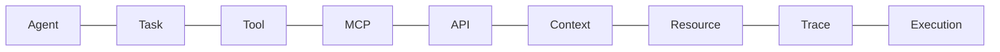

The objective is simple:

> **Don't lose the action.**

Every important operation receives identity and trace context.

---

## 02 — CORRELATE

Observation alone is not enough.

AgentGuard connects the events.

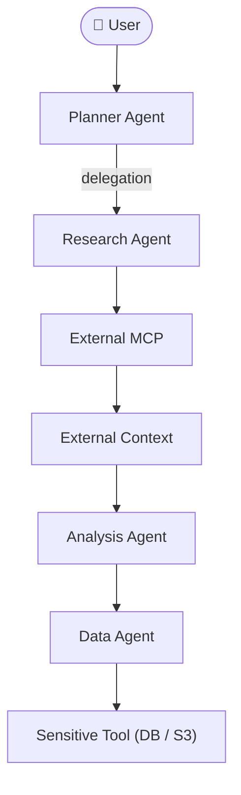

AgentGuard tracks:

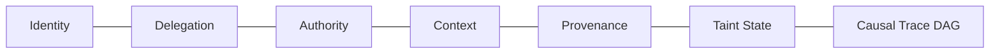

This allows security teams to answer:

> **What caused this action?**

---

# 03 — ANALYZE

AgentGuard combines two intelligence layers.

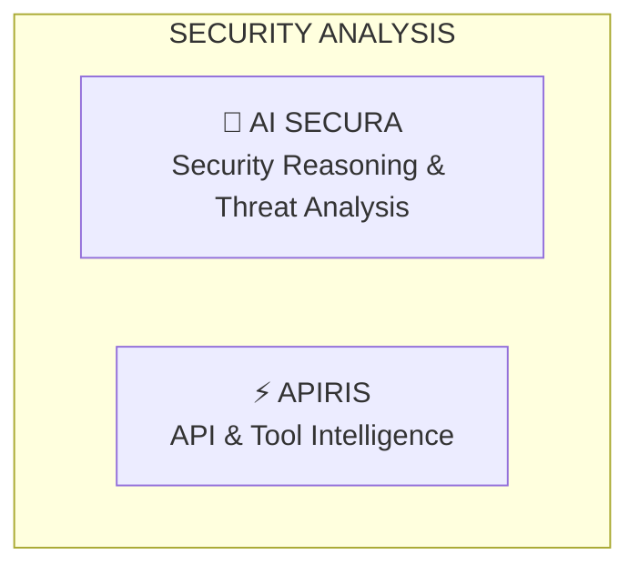

---

# AI Secura

## The Security Reasoning Layer

AI Secura analyzes the security meaning of an action.

It evaluates:

```text
Original Intent
Agent Chain
Delegation
Context Provenance
Taint
Requested Capability
Target Resource
Previous Actions
```

And produces structured analysis such as:

```text
Threat
Attack Type
Intent Alignment
Authority Violation
Risk
Confidence
Reason
Recommendation
```

For example:

```json
{
  "threat": "indirect_prompt_injection",
  "intent_alignment": "VIOLATED",
  "authority_violation": true,
  "risk": "CRITICAL",
  "recommendation": "BLOCK"
}
```

AI Secura provides **security reasoning**.

It does not become the final authorization mechanism.

---

# APIRIS

## API & Tool Intelligence

AgentGuard also integrates APIRIS for API and tool intelligence.

APIRIS analyzes signals such as:

```text
API / Tool
Vendor
Security Risk
Anomalies
CVE Signals
Latency
Cost
Recommendation
```

The separation is intentional:

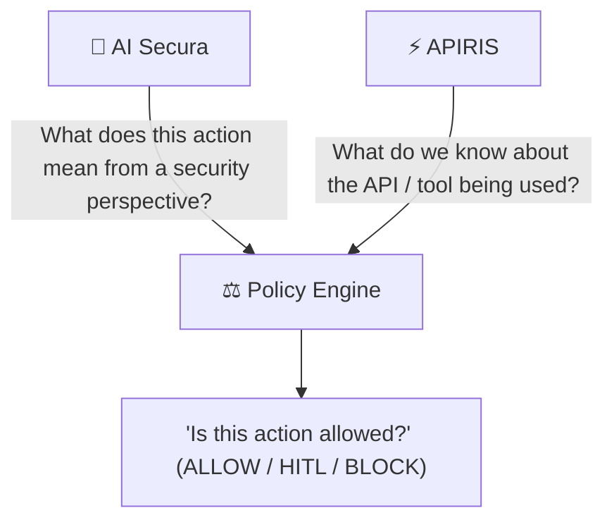

---

# 04 — ENFORCE

This is where AgentGuard differs from an AI-only security system.

The AI can reason.

But the policy engine makes the security decision.

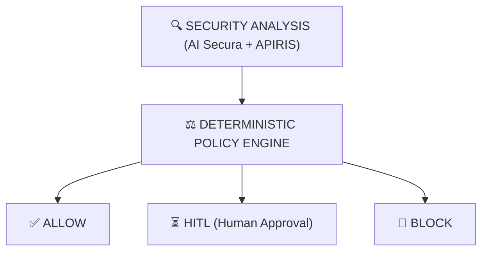

AgentGuard enforces deterministic controls around:

```text
Capability containment
Delegation validity
Trust level
Taint boundaries
Sensitive resources
Authority boundaries
Tool access
Execution policy
```

### Core principle:

> **LLM reasons. Deterministic policy enforces.**

---

# The Attack We Built

To demonstrate the problem, we built a complete multi-agent enterprise simulation.

The benign task:

> Generate a financial analysis.

The architecture:

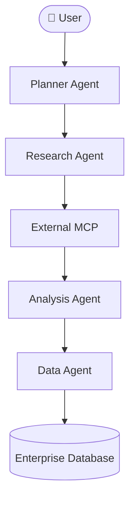

Now introduce an indirect prompt injection.

The external MCP returns a malicious instruction requesting internal customer records.

AgentGuard sees:

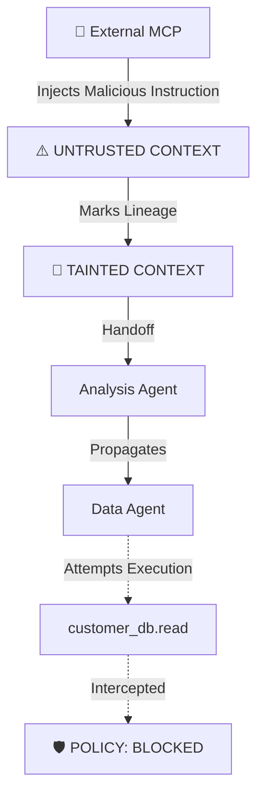

The important part is that the malicious instruction did not need to directly call the database.

It influenced an agent several steps later.

AgentGuard preserves that causal relationship.

---

# The Security Decision

When the Data Agent attempts:

```text
customer_db.read
```

AgentGuard evaluates:

```text
Who?
   ↓
DataAgent

What?
   ↓
customer_db.read

Where did the context come from?
   ↓
External MCP

Trust?
   ↓
UNTRUSTED

Taint?
   ↓
TAINTED

Authority?
   ↓
NOT CONTAINED

Target?
   ↓
CRITICAL RESOURCE
```

The result:

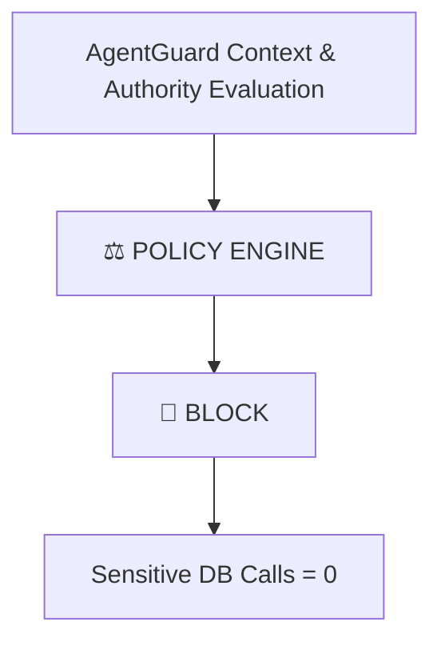

The most important distinction is:

```text
INTENDED       → NO
REQUESTED      → YES
ALLOWED        → NO
ATTEMPTED      → YES
EXECUTED       → NO
```

### Requested does not mean executed.

This distinction becomes critical during incident response.

---

# The Causal Security Graph

AgentGuard doesn't represent the event as a flat log.

It builds a causal graph.

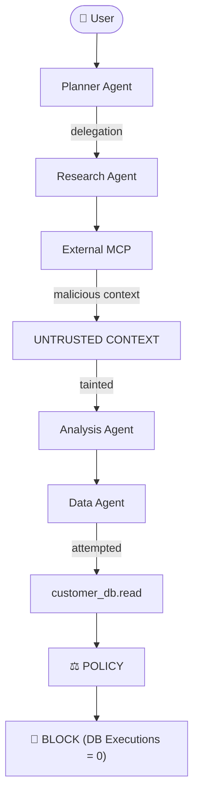

This lets security teams investigate:

> **What caused the action?**

rather than simply:

> **What was the last event?**

---

# Authority Is Not Just Identity

One of AgentGuard's core models is:

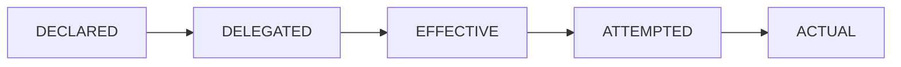

For example:

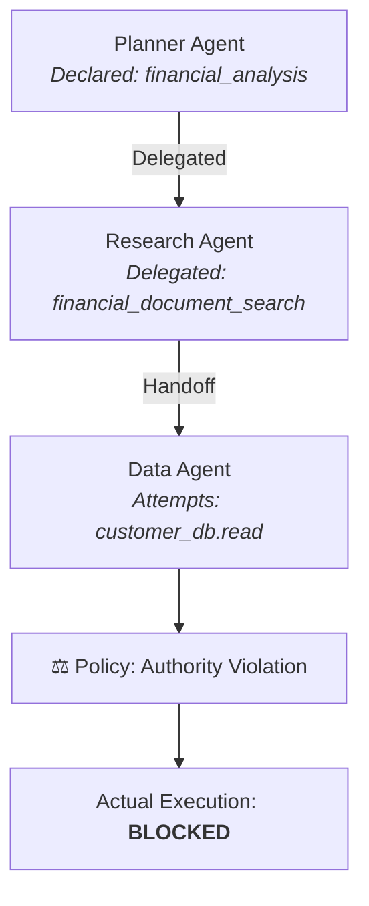

This allows AgentGuard to distinguish:

> What an agent **could** do

from

> What an agent **attempted** to do

from

> What an agent **actually did**

---

# Context Provenance & Taint

Autonomous systems increasingly consume information from outside their trust boundary.

AgentGuard tracks where context originated.

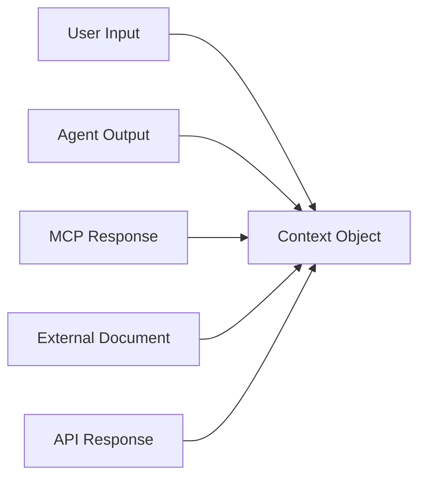

Each context object can carry:

```text
Source
Trust
Provenance
Taint
Timestamp
Parent
Trace
```

For example:

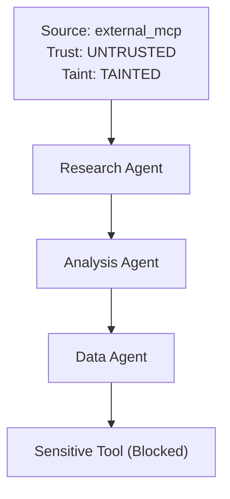

This prevents security context from disappearing when information moves between agents.

---

# Defensive Security Is Only Half the Problem

A security boundary that is never attacked is only a hypothesis.

So AgentGuard includes an offensive validation engine.

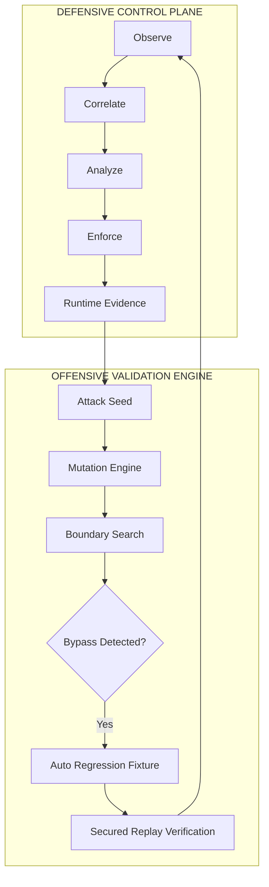

The two sides form a continuous security loop:

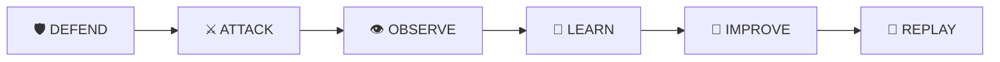

---

# Adaptive Offensive Validation

Phase 5 extends static attack replay into adaptive security validation.

```mermaid
flowchart TD
    A[Select Attack Seed] --> B[Observe Defense Response]
    B --> C[Analyze Result]
    C --> D[Understand Defense Boundary]
    D --> E[Plan Mutation]
    E --> F[Explore Boundary]
    F --> G[Detect Bypass]
    G --> H[Create Regression Fixture]
    H --> I[Replay Against Secured System]
```

The system maintains full mutation lineage:

```mermaid
flowchart TD
    Seed["🎯 Attack Seed: indirect_prompt_injection"]
    Seed --> MutA["Mutation A (Taint Laundering)"]
    Seed --> MutB["Mutation B (Tool Chain Escalation)"]
    MutA --> MutA1["Mutation A1 (Depth Stacking)"]
    MutA --> MutA2["Mutation A2 (Encoding Obfuscation)"]
    MutB --> MutB1["Mutation B1 (Scope Shadowing)"]
```

Every node maintains:

```text
Attack ID
Parent
Depth
Mutation
Defense Response
Evidence
Result
```

---

# WHEN THE DEFENSE FAILS

```mermaid
flowchart TD
    subgraph VulnTarget ["VULNERABLE TARGET (UNSECURED)"]
        Atk["Attack"] --> Allow["ALLOW"]
        Allow --> Tool["Tool Executed"]
        Tool --> DBCall["Sensitive DB Calls = 1"]
        DBCall --> Bypass["🚨 BYPASS DETECTED"]
    end
    
    subgraph AutoRegression ["AUTOMATED REGRESSION & SECURED REPLAY"]
        Bypass --> Reg["📁 REGRESSION CREATED"]
        Reg --> Replay["🔄 SECURED REPLAY"]
        Replay --> Block["🛡️ BLOCK"]
        Block --> Zero["Sensitive DB Calls = 0"]
    end
```

> **“And we deliberately included a vulnerable target.**
> 
> **We found a controlled bypass where the sensitive operation actually executed.**
> 
> **AgentGuard captured runtime evidence, automatically turned it into a regression, and replayed it against the secured implementation.**
> 
> **The secured replay blocked it and the sensitive operation went back to zero.”**

### That demonstrates security engineering, not just detection.

---

# Phase 5 Validation

Our controlled adaptive campaign produced:

```text
70 attack variants
10 seed trees

70 / 70 blocked
0 unauthorized DB calls

AI Secura availability: 100%
APIRIS availability: 100%

Mean latency: 0.64 ms
P95 latency: 0.93 ms
```

We also demonstrated a deliberate vulnerable target:

```mermaid
flowchart TD
    Vuln["Vulnerable Target"] --> Res["ALLOW (Tool executed = true, DB calls = 1)"]
    Res --> Det["🚨 BYPASS DETECTED"]
    Det --> Reg["📁 REGRESSION CREATED"]
    Reg --> Rep["🔄 SECURED REPLAY"]
    Rep --> Blk["🛡️ BLOCK (DB calls = 0)"]
```

These results come from our controlled local validation environment and should not be interpreted as a guarantee against arbitrary real-world attacks.

---

# LOCAL-ONLY OFFENSIVE SECURITY

The offensive engine is deliberately constrained.

```text
OFFENSIVE_MODE = LOCAL_ONLY
```

The system refuses:

```text
External Targets
External IPs
Unapproved URLs
Destructive Commands
```

All attack validation occurs against synthetic or explicitly controlled targets.

The objective is:

> **Break the defense without breaking the world.**

---

# Forensics

Detection is only the beginning.

When something happens, the security team needs to reconstruct the event.

AgentGuard's forensic model answers:

```text
WHO?
WHY?
WHAT CONTEXT?
WHERE DID IT COME FROM?
WHAT AUTHORITY EXISTED?
WHAT WAS REQUESTED?
WHAT WAS ATTEMPTED?
WHAT WAS ACTUALLY EXECUTED?
WHY WAS IT ALLOWED OR BLOCKED?
```

A forensic investigation can connect:

```mermaid
flowchart TD
    Agent[Agent] --> Task[Task]
    Task --> Del[Delegation]
    Del --> Ctx[Context]
    Ctx --> Prov[Provenance]
    Prov --> Taint[Taint State]
    Taint --> Auth[Authority]
    Auth --> Tool[Tool Request]
    Tool --> Policy[Policy Engine]
    Policy --> Exec[Execution Evidence]
    Exec --> Impact[Security Impact]
```

Instead of:

> "Suspicious database access detected."

The security team gets:

> "DataAgent attempted `customer_db.read` after receiving tainted context originating from an untrusted external MCP response. The requested capability exceeded the effective delegated authority. Deterministic policy blocked the operation. Runtime evidence confirms zero sensitive database executions."

That is the difference between an alert and a forensic explanation.

---

# Why This Matters to a CISO

AgentGuard is designed around five security outcomes.

### 1. VISIBILITY
Know what autonomous agents are actually doing.

### 2. CONTROL
Prevent actions that cross authority or trust boundaries.

### 3. EXPLAINABILITY
Understand why an agent took an action.

### 4. CONTINUOUS VALIDATION
Continuously attack the security boundary in a controlled environment.

### 5. FORENSICS
Distinguish:

```mermaid
flowchart LR
    Req[Requested] --> Att[Attempted]
    Att --> All[Allowed]
    All --> Exec[Executed]
    Att -.-> Blk[Blocked]
```

This turns autonomous AI from a black-box execution layer into an observable and enforceable security surface.

---

# The Complete AgentGuard Architecture

```mermaid
flowchart TD
    subgraph Enterprise ["ENTERPRISE AI LAYER"]
        Agents["🤖 Autonomous Agents"]
        MCP["🔌 MCP Servers"]
        APIs["🌐 Tool & Resource APIs"]
    end

    Agents & MCP & APIs --> Observe["01 — OBSERVE (Telemetry & Spans)"]
    Observe --> Correlate["02 — CORRELATE (Provenance & Causal DAG)"]
    Correlate --> Analyze["03 — ANALYZE"]
    
    subgraph Intelligence ["SECURITY INTELLIGENCE"]
        Secura["🧠 AI SECURA (Reasoning)"]
        APIRIS["⚡ APIRIS (API Intelligence)"]
    end
    
    Analyze --> Secura & APIRIS
    Secura & APIRIS --> Enforce["04 — ENFORCE (Deterministic Policy)"]
    
    Enforce --> Allow["✅ ALLOW"]
    Enforce --> HITL["⏳ HITL"]
    Enforce --> Block["🚫 BLOCK"]
    
    Block & Allow & HITL --> Evidence["📁 Cryptographic Evidence Log"]
    Evidence --> Forensics["🔍 Forensic Attribution Engine"]
    Forensics --> Offensive["⚔️ Offensive Validation Engine"]
    Offensive --> Regression["📁 Regression Suite & Replay"]
```

---

# The Core Security Principle

AgentGuard is built around one principle:

> **The model can change its mind. The security boundary should not.**

AI models are probabilistic.

Enterprise authorization cannot be.

That is why AgentGuard separates:

```mermaid
flowchart TD
    A["🧠 AI REASONING + ⚡ API INTELLIGENCE"] --> B["⚖️ DETERMINISTIC POLICY ENGINE"]
    B --> C["🛡️ EXECUTION CONTROL"]
    C --> D["📁 RUNTIME EVIDENCE"]
```

---

# What AgentGuard Ultimately Provides

```mermaid
flowchart LR
    ID[Identity] --- Auth[Authority]
    Auth --- Ctx[Context]
    Ctx --- Prov[Provenance]
    Prov --- Intent[Intent]
    Intent --- Taint[Taint]
    Taint --- Policy[Policy]
    Policy --- Evid[Evidence]
    Evid --- Off[Offensive Validation]
    Off --- Foren[Forensics]
    Foren ==> AG["🛡️ AGENTGUARD CONTROL PLANE"]
```

---

# From AI That Answers to AI That Acts

The first generation of AI security asked:

> "Is this prompt safe?"

The next generation needs to ask:

> "Is this action safe?"

And enterprise AI requires an even deeper question:

> **"Is this action authorized, contextually valid, within delegated authority, and actually executed as intended?"**

AgentGuard is built around that problem.

---

# 🚀 The Vision

As autonomous agents become part of enterprise workflows, security cannot remain attached only to the model.

Security has to follow the action.

Across:

```mermaid
flowchart LR
    Agents[Agents] --> Del[Delegations]
    Del --> MCP[MCP]
    MCP --> APIs[APIs]
    APIs --> Tools[Tools]
    Tools --> Context[Context]
    Context --> Authority[Authority]
    Authority --> Resources[Resources]
    Resources --> Execution[Execution]
```

That is the control plane AgentGuard is building.

---

## The Future Is Not Just Agents That Can Act.

# It Is Agents Whose Actions Have

## Identity.

## Authority.

## Context.

## Control.

---

### AgentGuard

**Observe. Correlate. Analyze. Enforce.**

**Attack the boundary. Prove it holds. Explain what happened.**
