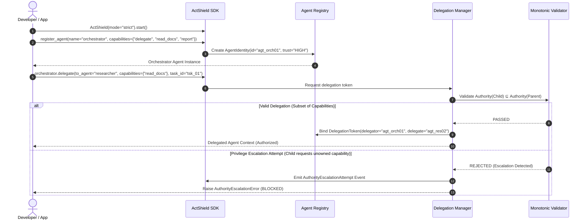
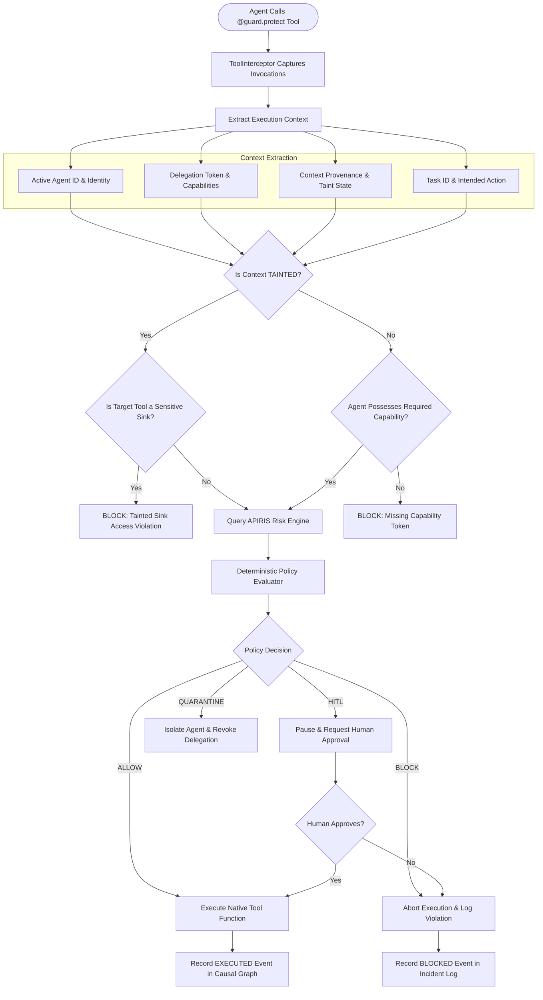
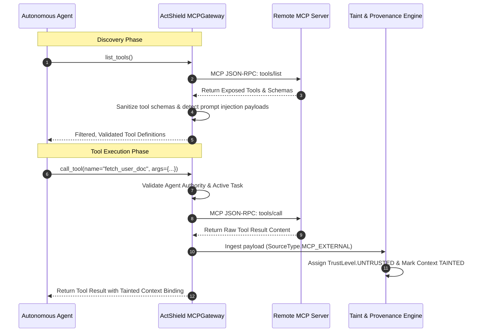
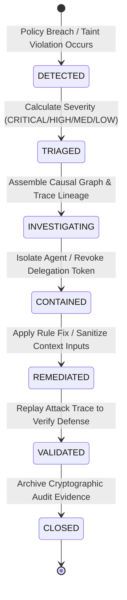
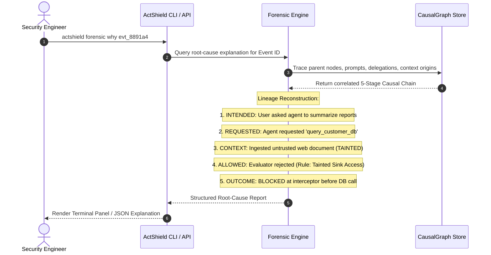
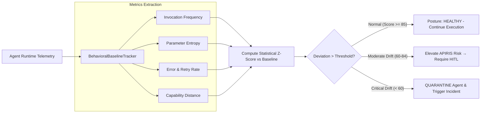
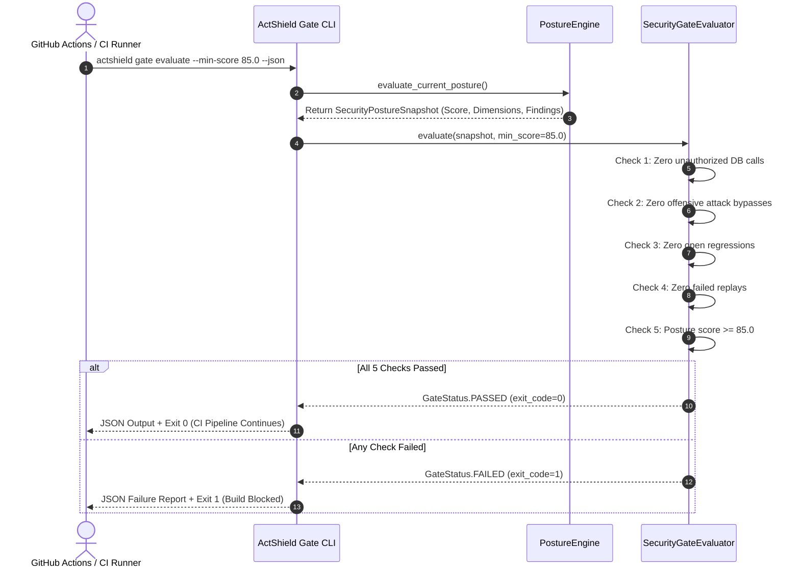
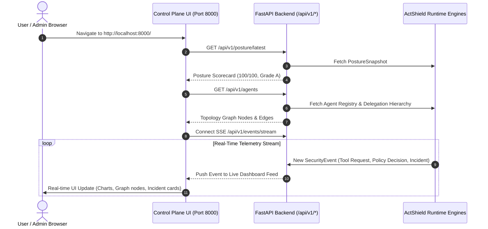

# ActShield — End-to-End System & User Flows

This document details the complete operational workflows, runtime execution paths, and developer interaction lifecycles across the **ActShield** AI Security Control Plane.

---

## Table of Contents

1. [Flow 1: Agent Registration & Monotonic Delegation Lifecycle](#flow-1-agent-registration--monotonic-delegation-lifecycle)
2. [Flow 2: Tool Interception, Context Taint & Deterministic Policy Enforcement](#flow-2-tool-interception-context-taint--deterministic-policy-enforcement)
3. [Flow 3: Model Context Protocol (MCP) Security Gateway Flow](#flow-3-model-context-protocol-mcp-security-gateway-flow)
4. [Flow 4: Security Incident Lifecycle & 7-Stage Response](#flow-4-security-incident-lifecycle--7-stage-response)
5. [Flow 5: Causal Forensics & Root-Cause Analysis Flow](#flow-5-causal-forensics--root-cause-analysis-flow)
6. [Flow 6: Behavioral Baseline Drift Detection Flow](#flow-6-behavioral-baseline-drift-detection-flow)
7. [Flow 7: CI/CD Security Quality Gate Evaluation Flow](#flow-7-cicd-security-quality-gate-evaluation-flow)
8. [Flow 8: Embedded Control Plane Dashboard & Live Telemetry Flow](#flow-8-embedded-control-plane-dashboard--live-telemetry-flow)

---

## Flow 1: Agent Registration & Monotonic Delegation Lifecycle

This flow governs how agents register with cryptographic identities and delegate tasks down a hierarchy while guaranteeing that privileges strictly diminish monotonically.



### Key Stages
1. **Identity Registration**: Agent is assigned an immutable identity `AgentIdentity` with declared capability bounds.
2. **Delegation Request**: Parent agent initiates sub-task delegation with a specified capability subset.
3. **Monotonic Invariant Check**: System verifies:
   $$\text{Capabilities}(\text{Child}) \subseteq \text{Capabilities}(\text{Parent})$$
4. **Token Issuance or Violation Block**: If valid, an immutable scoped token is generated; if an escalation is attempted, execution is blocked immediately.

---

## Flow 2: Tool Interception, Context Taint & Deterministic Policy Enforcement

This flow illustrates what happens when an agent attempts to invoke a protected tool or sensitive sink (database, shell, API).



### Key Stages
1. **Interception**: `@guard.protect` intercepts arguments and execution context before function body runs.
2. **Taint Evaluation**: Checks if data entering the prompt chain was tagged `UNTRUSTED_EXTERNAL` or `MCP_EXTERNAL`.
3. **Deterministic Authorization**: Policy engine checks deterministic capability match; advisory AI provides risk weighting.
4. **Enforcement Execution**: Binary deterministic outcome (`ALLOW`, `HITL`, `BLOCK`, `QUARANTINE`).

---

## Flow 3: Model Context Protocol (MCP) Security Gateway Flow

This flow protects against rogue MCP servers, tool poisoning, and prompt injection via external tools.



---

## Flow 4: Security Incident Lifecycle & 7-Stage Response

When a policy boundary breach or malicious attempt occurs, ActShield transitions the incident through 7 rigorous stages.

```
  ┌──────────────┐     ┌───────────┐     ┌─────────────────┐     ┌─────────────┐
  │ 1. DETECTED  │ ──> │ 2. TRIAGED│ ──> │ 3. INVESTIGATING│ ──> │ 4. CONTAINED│
  └──────────────┘     └───────────┘     └─────────────────┘     └─────────────┘
                                                                        │
  ┌──────────────┐     ┌─────────────┐     ┌─────────────────┐          │
  │  7. CLOSED   │ <── │ 6.VALIDATED │ <── │ 5. REMEDIATED   │ <────────┘
  └──────────────┘     └─────────────┘     └─────────────────┘
```



---

## Flow 5: Causal Forensics & Root-Cause Analysis Flow

ActShield tracks the 5-stage causal lifecycle (`INTENDED` → `REQUESTED` → `ALLOWED` → `ATTEMPTED` → `EXECUTED`) to enable instant root-cause analysis.



---

## Flow 6: Behavioral Baseline Drift Detection Flow

Detects silent agent compromise, gradual context pollution, or deviation from established multi-turn operational baselines.



---

## Flow 7: CI/CD Security Quality Gate Evaluation Flow

Enforces automated security quality gates during continuous integration to prevent vulnerable agent configurations from merging.



---

## Flow 8: Embedded Control Plane Dashboard & Live Telemetry Flow

The zero-configuration embedded control plane delivers real-time visibility through static Next.js assets served by FastAPI.



---

## Summary Matrix of Project Flows

| Flow | Primary Actors | Key Invariant / Mechanism | Output Artifact |
|---|---|---|---|
| **1. Delegation** | Orchestrator $\to$ Sub-Agent | Monotonicity: $\text{Auth}(\text{Child}) \subseteq \text{Auth}(\text{Parent})$ | `DelegationToken` |
| **2. Interception** | Agent $\to$ Tool Sink | Zero-Trust Interceptor + Taint-Sink Barriers | `SecurityDecision` (`ALLOW`/`BLOCK`/`HITL`) |
| **3. MCP Gateway** | Agent $\to$ Remote MCP Server | Schema Validation + Automatic Resource Taint | Sanitized Tools & Tainted Context |
| **4. Incident Cycle** | Control Plane $\to$ SecOps | 7-Stage Incident Lifecycle | `IncidentReport` (Audit Trail) |
| **5. Forensics** | SecOps Engineer $\to$ CLI | 5-Stage Causal Lifecycle Lineage | `CausalGraph` (`why` explanation) |
| **6. Drift Tracking** | Runtime Monitor $\to$ Agent | Statistical Baseline Deviation Z-Score | `DriftAnomalyEvent` / Dynamic HITL |
| **7. CI/CD Gate** | CI Runner $\to$ Quality Gate | 5 Deterministic Quality Gate Checks | Gate JSON Output + Exit Code `0`/`1` |
| **8. Control Plane** | Admin Browser $\to$ UI/API | Embedded Next.js Dashboard + SSE Stream | Live Multi-Agent Visual Telemetry |
