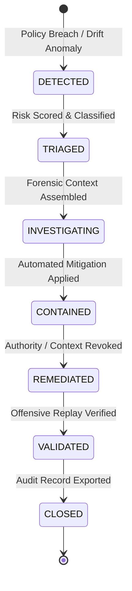

# ActShield Security Incident Response Plan

**Version:** 1.0.0  
**Domain:** Autonomous Agent & Multi-Agent AI Security Operations  
**Framework:** NIST SP 800-61 Rev. 2 / SANS Incident Handler's Handbook Aligned

---

## 1. Overview

This document specifies the deterministic incident lifecycle, automated containment protocols, and forensic investigation workflows for security incidents detected by the ActShield Security Control Plane.

---

## 2. Incident Lifecycle State Machine

ActShield executes a strict 7-state deterministic incident lifecycle:



### 2.1 State Definitions

| State | Description | Automated Action | Required Verification |
|---|---|---|---|
| `DETECTED` | Runtime policy violation, taint breach, or drift spike detected | Emit `SECURITY_INCIDENT` event, assign `incident_id` | Trace ID and agent correlation bound |
| `TRIAGED` | Severity assessed (`LOW`, `MEDIUM`, `HIGH`, `CRITICAL`) | Risk scoring calculated across 6 dimensions | Incident severity assigned |
| `INVESTIGATING` | Causal lineage and execution truth gathered | Full causal graph reconstructed from event store | Intent vs. Request diff analyzed |
| `CONTAINED` | Active threat neutralized | Context quarantined, agent capabilities restricted | Active executions suspended |
| `REMEDIATED` | Threat root-cause resolved | Authority grant revoked, policy rules updated | Tainted memory flushed |
| `VALIDATED` | Security posture confirmed | Automated offensive regression suite replayed | Zero bypasses on replay |
| `CLOSED` | Post-incident report finalized | Timeline audited, SIEM records archived | Compliance signoff completed |

---

## 3. Automated Response Orchestration

When a policy violation exceeds the configured risk threshold (`default_risk_threshold: 0.70`), ActShield triggers automated response actions:

1. **Context Quarantining (`QUARANTINE_CONTEXT`)**:
   - The tainted context object is marked `TaintState.QUARANTINED`.
   - Any subsequent attempt by any downstream agent to read from this context raises a security block.

2. **Capability Restriction (`RESTRICT_CAPABILITY`)**:
   - The offending agent's trust level is demoted (`AgentTrustLevel.UNTRUSTED` or `AgentStatus.QUARANTINED`).
   - Dynamic authority delegation permissions are suspended.

3. **Human-In-The-Loop Escalation (`ESCALATE_HITL`)**:
   - For high-impact operations, an approval request is dispatched to the security team.
   - Execution is paused pending human authorization or timeout rejection.

---

## 4. Forensic Investigation Workflow

### 4.1 Root-Cause Attribution (Execution Truth)
When investigating a blocked action, investigators use the ActShield Forensic CLI:

```bash
actshield forensic why evt_blocked_991
```

The output presents the **Four-Point Execution Truth**:
- **INTENDED:** Was this action aligned with the root task intent?
- **REQUESTED:** Did an agent attempt to issue this tool request?
- **ALLOWED:** Did deterministic policy allow the invocation?
- **EXECUTED:** Did the tool actually execute against the underlying resource?

### 4.2 Causal Lineage Reconstruction
```bash
actshield forensic trace trc_994a8b21c
```
Reconstructs the full causal graph across all agent hops, delegation boundaries, and context transformations.

---

## 5. Post-Incident Offensive Replay

Following incident resolution, the attack vector is converted into an automated regression fixture in `AttackCorpus` to prevent future regressions. The CI/CD security quality gate continuously verifies that the remediated vector remains 100% blocked.
