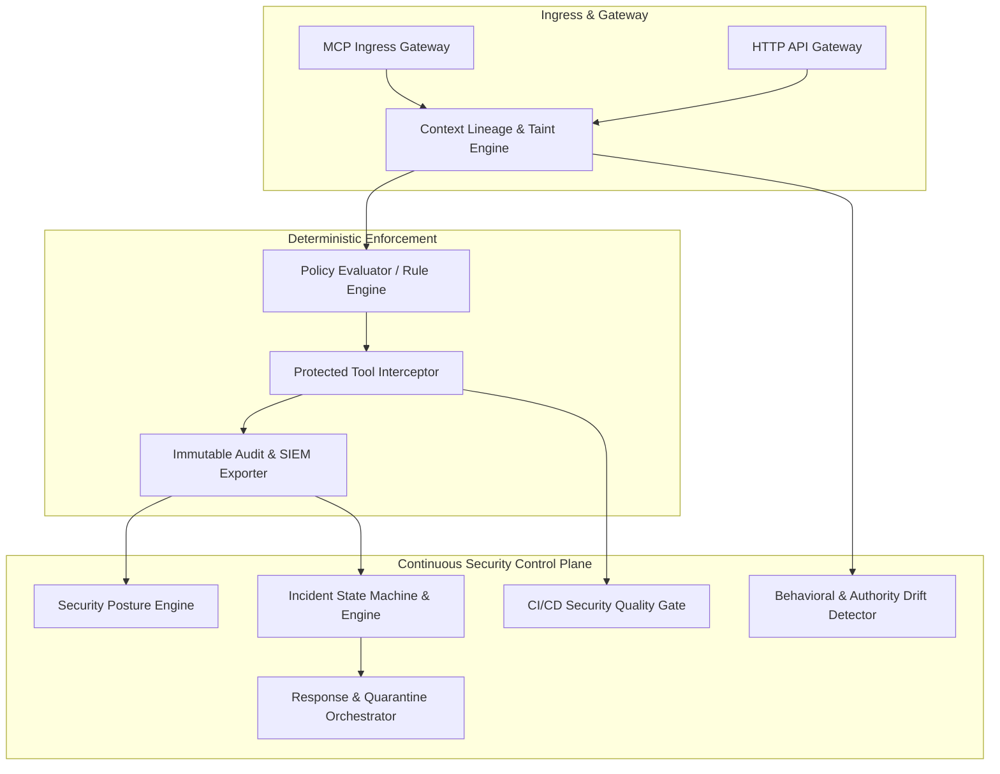

# AgentGuard Phase 9: Enterprise Continuous Security Architecture

## 1. System Overview
AgentGuard Phase 9 provides an end-to-end continuous security control plane for multi-agent autonomous AI systems. It unifies runtime policy enforcement, causal lineage tracking, behavioral drift detection, incident lifecycle state machines, automated response orchestration, and CI/CD security quality gates.

## 2. Core Control Plane Modules
- **Security Posture Engine (`sdk/agentguard/posture/`)**: Derives mathematical, explainable security posture ratings (A–F / HEALTHY–CRITICAL) from concrete runtime telemetry without arbitrary weights.
- **Incident Lifecycle Engine (`sdk/agentguard/incidents/`)**: 7-stage deterministic state machine (`DETECTED` -> `TRIAGED` -> `INVESTIGATING` -> `CONTAINED` -> `REMEDIATED` -> `VALIDATED` -> `CLOSED`) with immutable timeline audits.
- **Response Orchestration (`sdk/agentguard/response/`)**: Automated mitigation actions including context quarantining, capability restriction, and dynamic authority restoration.
- **Security Drift Tracker (`sdk/agentguard/drift/`)**: Statistical profiling and detection of capability creep, novel resource targeting, and context taint degradation.
- **CI/CD Quality Gates (`sdk/agentguard/gates/`)**: Automated deterministic build gates validating zero unauthorized DB calls, zero bypasses, zero open regressions, and 100% attack containment.
